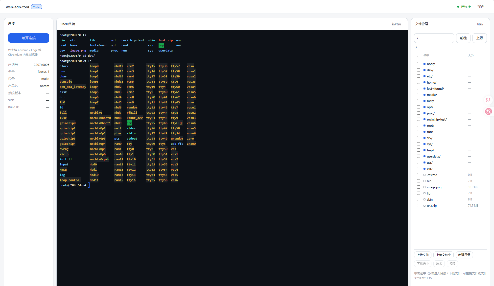

# web-adb-tool

**简体中文** | [English](README.en.md)

基于 **WebUSB** 的浏览器端 ADB 工具，无需安装任何驱动或 adb 可执行文件，打开网页即可连接设备（针对全志 / 瑞芯微等 Linux 板，兼容 Android 设备）。



## 功能

- 真终端 Shell —— 基于 [xterm.js](https://xtermjs.org/) 的交互式终端，键盘直接输入、实时回显，支持方向键 / 历史 / Ctrl+C / 清屏，体验等同 SSH；自动探测 bash（Tab 补全 + 行编辑）
- 文件管理器 —— 目录浏览（名称 / 大小 / 权限）、多选、新建目录、改名、chmod，面包屑 + 路径直达；删除请在 Shell 栏使用 `rm`
- 文件传输 —— 单文件 / 多文件 / 整个文件夹上传（含拖拽到面板）、单文件下载、**整目录递归打包为 zip 下载**，带实时进度条与速率
- 设备信息 —— 型号、设备名、系统版本、SDK 等
- 可拖拽布局 —— 连接 / Shell / 文件三栏间的分隔条可拖动调宽（宽度自动记忆），文件栏收窄时自动隐藏次要列
- 主题切换 —— 内置浅色 / 深色两套皮肤，终端配色随主题联动

## 技术栈

- 前端：HTML / CSS / TypeScript + [Vite](https://vite.dev/)
- ADB 协议：[`@yume-chan/adb`](https://github.com/yume-chan/ya-webadb)（纯 JS 实现，无需 WASM）
- 终端：[`@xterm/xterm`](https://xtermjs.org/) + `@xterm/addon-fit`
- 传输：WebUSB（`@yume-chan/adb-daemon-webusb`）
- 凭证：WebCrypto RSA（`@yume-chan/adb-credential-web`）
- 部署：GitHub Pages（纯静态，无后端）

## 本地开发

```bash
npm install
npm run dev
```

## 构建

```bash
npm run build   # 产物输出到 dist/
```

## 部署

`deploy` 分支 push 后由 GitHub Actions 自动构建并部署到 GitHub Pages：

```
https://<账号>.github.io/web-adb-tool/
```

## 使用说明

1. 仅支持 **Chrome / Edge** 等 Chromium 内核浏览器（WebUSB 标准，Firefox/Safari 不支持）。
2. 页面需通过 **HTTPS**（或 localhost）访问，GitHub Pages 已满足。
3. 连接前请关闭本机其他占用 ADB 的进程（`adb kill-server`），否则会报 "Unable to claim interface"。
4. 点击「连接设备」后，在弹出的设备列表中选择目标板，按提示完成授权（Linux 板通常免授权）。

## 架构约定（换肤 / 换布局）

- **换肤**：所有颜色 / 间距 / 圆角 / 字体集中在 `src/styles/themes.css` 的设计 token（CSS 变量）。新增皮肤 = 新增一个 `[data-theme="xxx"]` 块。
- **换布局**：分区排列集中在 `src/styles/layout.css`（当前为「顶栏 + 三栏」），改 `grid-template-*` 即可，无需动 DOM。
- **换设计**：组件视觉集中在 `src/styles/components.css`，只引用 token 变量。
- **底层解耦**：所有 ADB 交互封装在 `src/core/adb.ts` 的 `AdbClient`，UI 层不直接接触协议。

## 已知限制

- 无线连接（ADB over Wi-Fi）需要 WebSocket 中继或浏览器扩展，纯静态页无法直连 TCP，暂未实现。
